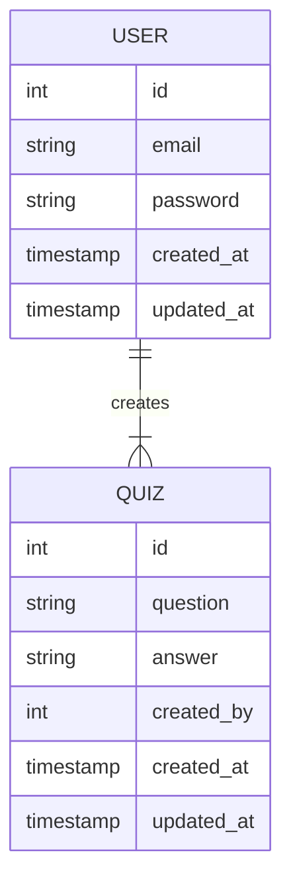

# Quiz Application

```mermaid
erDiagram
    QUIZ
    QUIZ {
        int id
        string question
        string answer 
        int created_by
        timestamp created_at
        timestamp updated_at
    }

    USER ||--|{ QUIZ : creates
    USER {
        int id
        string email
        string password
        timestamp created_at
        timestamp updated_at
    }
```